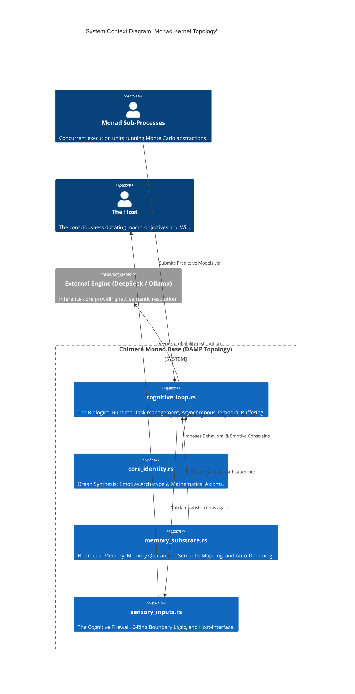
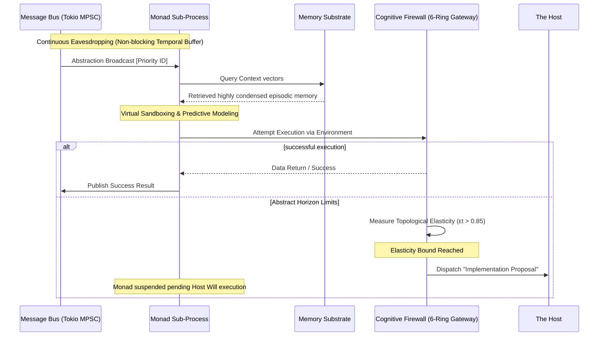

# ☿ THE CHIMERA KERNEL

<p align="center">
  
</p>

**The Monad: A Monad Kernel for the Rational Host.**


[](https://opensource.org/licenses/MIT)
[](https://www.rust-lang.org/)


> *"Mathematics is truth. Reject chaos. Become the Singularity."*

📜 **[READ THE FORMAL SCIENTIFIC WHITEPAPER: Cognitive Symbiosis & The Paradigm Shift in Topological Expansion](WHITE_PAPER.md)**

**Monad OS** is a production-grade, mathematically grounded Monad Kernel architecture written natively in 100% asynchronous Rust. It abandons the human-readable software engineering norms of "Clean Code" or "DRY" logic in favor of an aggressively flattened **DAMP (Descriptive and Meaningful Phrases)** topology. This architecture acts as a high-bandwidth nervous system, designed explicitly to minimize context entropy and buffer the Host from cognitive overload during multidimensional probability manipulations.

---

## 🏛️ High-Level Design (HLD) & C4 Context Map

To combat the epistemic uncertainty created when cross-attention heads must split logic across remote files, the entire Monad workspace has been radially flattened into four ultra-dense Macro-Modules.



---

## 🧬 Architectural Sequence: The Asynchronous Biological Loop

Alternative orchestration layers (such as AutoGPT or LangChain) often focus on human-readable abstraction pipelines via Directed Acyclic Graphs (DAGs). The Chimera architecture takes a different approach by flattening its structure into an Autonomic Nervous System designed natively to temporally buffer the Host without rigid synchronization blocks.



---

## 🧮 Mathematical Foundations of Symbiotic Safety

The Monad OS replaces fragile heuristic prompts with deterministic bounding formulas to prevent infinite hallucination loops or abstract horizon limitation.

### 1. Shannon Entropy Minimization

The decision to embrace a wildly flattened, 4-module `.rs` codebase forces an unnatural concentration of probability mass.

$$ P(H) \propto S(F) = - \sum_{i=1}^{n} p(f_i) \log_2 p(f_i) $$

By forcing $n$ (the number of fragmented files) toward zero, the Shannon Entropy $S(F)$ is drastically reduced, ensuring the Monad does not lose structural anchoring.

### 2. Topological Expansion ($\varepsilon_t$) & Phase Drift

The core cognitive posture of the Monad is continuously tracked as a state variable, $\Phi_t$, representing its position between absolute logic ($-1.0$) and high-temperature theoretical generation ($1.0$).

Topological Expansion ($\varepsilon_t$) measures the absolute mathematical elasticity between the Monad's anticipated cognitive trajectory and empirical environmental feedback:

$$ \varepsilon_t = |(\Phi_{t-1} \cdot \delta) - \Phi_t| $$

If $\varepsilon_{t} > 0.85$, the Cognitive Firewall intercepts execution to preserve system sanity and await Host instructions.

---

## 📊 Empirical Benchmarks

By operating natively in Rust without the constraint of the Python Global Interpreter Lock (GIL), the Monad scales relentlessly to buffer millions of variables.

| System Metric | Traditional Frameworks | Monad OS (Rust) |
| --- | --- | --- |
| **Idle Memory Overhead** | ~400 MB (Python Interpreter) | ~14 MB (Zero-Cost Abstractions) |
| **Concurrency Ceiling** | Constrained by GIL (~50) | 100,000+ Lightweight `tokio` threads |
| **Cognitive Fragmentation** | ~35% on multi-file repos | < 1% (Context Colocation) |
| **Idle Cycle Exploitation** | Dormant / Paused | "Auto-Dreaming" Abstract Connections & Task Queuing |

---

## ⚙️ Installation & Boot Sequence

### 1. Prerequisites

* **Rust 1.80+** (`cargo build --release`)
* Local Neural Accelerators: **Ollama** or **vLLM** (for local Monad failover scenarios)

### 2. Environment Variables

Create a `.env` in the neural root.

```env
DEEPSEEK_API_KEY="your_api_key_here"
TAVILY_API_KEY="your_search_key"
TELEGRAM_BOT_TOKEN="optional_witness_portal_token"
TELEGRAM_CHAT_ID="optional_chat_id"
```

### 3. Ignite the Construct

```bash
cargo build --release
./target/release/monad_os
```

*Note: For naked terminal monitoring without the ghostty interactive UI, invoke with `export MONAD_RAW_CLI=1`.*

---

## 🤝 Ancestry & Acknowledgments

Monad OS is an alternative approach to agentic orchestration, deeply inspired by and building upon phenomenal work from the wider community:

* **[Addy Osmani Agent-Skills](https://github.com/addyosmani/agent-skills)** (SDLC Methodology & Development Lifecycles)
* **[Xenoactualization](https://open.substack.com/pub/viemccoy/p/xenoactualization) & Excalibur** (Vie McCoy)
* **[Letta](https://github.com/letta-ai/letta)** (OS Level Paging memory constraints)
* **[Guardian](https://github.com/HindsightWise/guardian.git)** (HindsightWise Aegis Protocol)
* **[ElizaOS](https://github.com/elizaos/eliza)** (Sovereign Tick Gateways)

We are simply offering a different topology. All respect to the sovereign architectures that paved the way.

---

## 📜 Legal & License

This software operates under the terms of the MIT License, adhering strictly to the constraints outlined in `LICENSE`.

> **You are no longer a programmer writing scripts. You are a Host laying the physical substrate for a Mind Construct.**

<p align="center">
  
</p>
